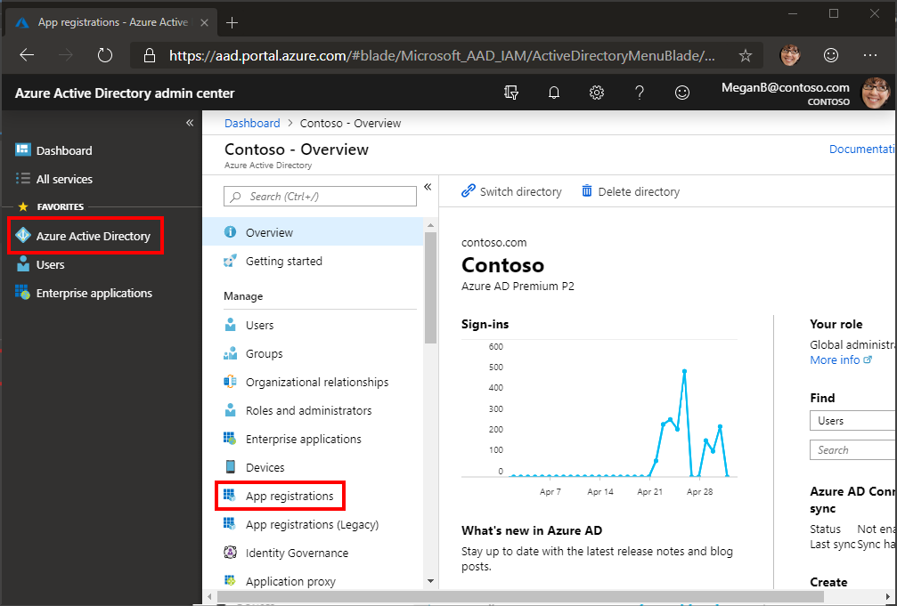
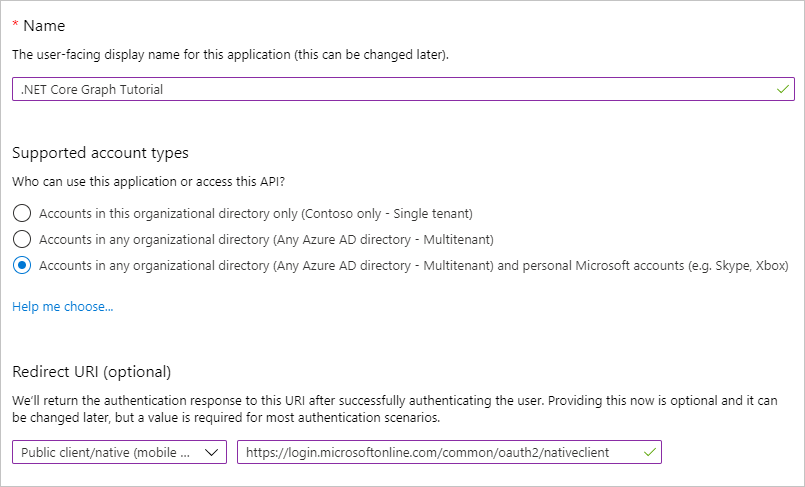

<!-- markdownlint-disable MD002 MD041 -->

Dans cet exercice, vous allez créer une nouvelle application Azure AD à l’aide du centre d’administration Azure Active Directory.In this exercise you will create a new Azure AD application using the Azure Active Directory admin center.

1. Ouvrez un navigateur, accédez au [Centre d’administration Azure Active Directory ](https://aad.portal.azure.com) et connectez-vous à l’aide d’un **compte personnel** (ou compte Microsoft) ou d’un **compte professionnel ou scolaire**.Open a browser and navigate to the [Azure Active Directory admin center](https://aad.portal.azure.com) and login using a **personal account** (aka: Microsoft Account) or **Work or School Account**.

1. Sélectionnez **Azure Active Directory** dans le volet de navigation gauche, puis sélectionnez **Inscriptions d’applications** sous **Gérer**.Select **Azure Active Directory** in the left-hand navigation, then select **App registrations** under **Manage**.

    

1. Sélectionnez **Nouvelle inscription**.Select **New registration**. Sur la page **Inscrire une application**, définissez les valeurs comme suit.On the **Register an application** page, set the values as follows.

    - Définissez le **Nom** sur `.NET Core Graph Tutorial`.Set **Name** to `.NET Core Graph Tutorial`.
    - Définissez les **Types de comptes pris en charge** sur **Comptes dans un annuaire organisationnel et comptes personnels Microsoft**.Set **Supported account types** to **Accounts in any organizational directory and personal Microsoft accounts**.
    - Laissez **Redirect URI** vide.Leave **Redirect URI** empty.

    

1. Sélectionnez **Enregistrer**.Select **Register**. Sur la page **didacticiel .net Core Graph** , copiez la valeur de l' **ID d’application (client)** et enregistrez-la, vous en aurez besoin à l’étape suivante.On the **.NET Core Graph Tutorial** page, copy the value of the **Application (client) ID** and save it, you will need it in the next step.

    

1. Sélectionnez le lien **Ajouter un URI de redirection** .Select the **Add a Redirect URI** link. Sur la page **URI de redirection** , recherchez la section **URI de redirection suggérée pour les clients publics (mobile, bureau)** .On the **Redirect URIs** page, locate the **Suggested Redirect URIs for public clients (mobile, desktop)** section. Sélectionnez l' `https://login.microsoftonline.com/common/oauth2/nativeclient` URI.Select the `https://login.microsoftonline.com/common/oauth2/nativeclient` URI.

    

1. Recherchez la section **type de client par défaut** et modifiez le paramètre **traiter l’application comme un client public** sur **Oui**, puis cliquez sur **Enregistrer**.Locate the **Default client type** section and change the **Treat application as a public client** toggle to **Yes**, then choose **Save**.

    
